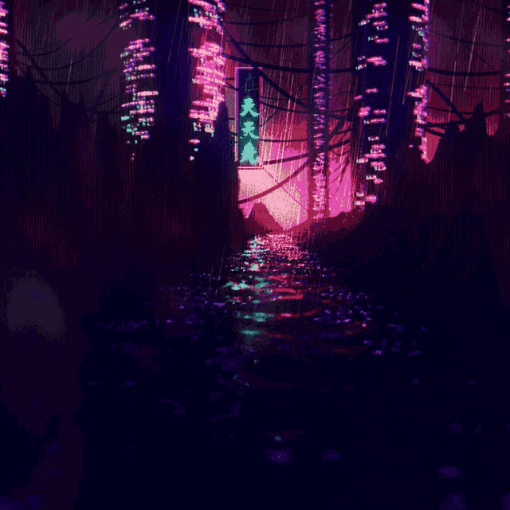
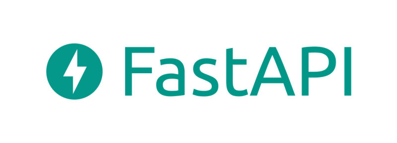

<picture>
  <source media="(prefers-color-scheme: light)" srcset="./japanese-morning-city.gif">
  <source media="(prefers-color-scheme: dark)" srcset="./chinese-night-city.gif">
  
</picture>

## Sobre meus projetos ✍

Aqui você irá encontrar projetos diversos, incluindo programação de baixo e alto nível de abstração.\
Já trabalhei em repositórios que abordam as seguintes áreas:

* 🔒 Criptografia
* 🤖 Robótica
* 📞 Redes de computadores
* 🖥 Desenvolvimento web
* 📱 Desenvolvimento mobile

Dentre os meus maiores interesses, estão projetos que envolvam trabalhar com servidores, com ênfase em protocolos de aplicação.\
Como podem ver, sou muito curioso e estou sempre disposto a aprender novas áreas para expandir o meu conhecimento.

## Tecnologias 🔬

Possuo experiência com diversas tecnologias comumente utilizadas no mercado de trabalho.\

### Linguagens com as quais possuo experiência

*  GO 
*   C/C++ 
*  Typescript 
*  Javascript 
*  Java 
*  Python 
* Assembly Risc-V 

### Linguagens que tenho interesse em aprender

*  C# 
*  Rust 

### Frameworks com os quais possuo experiência

*  React/React Native 

### Frameworks que tenho interesse em aprender

*  FastAPI 
