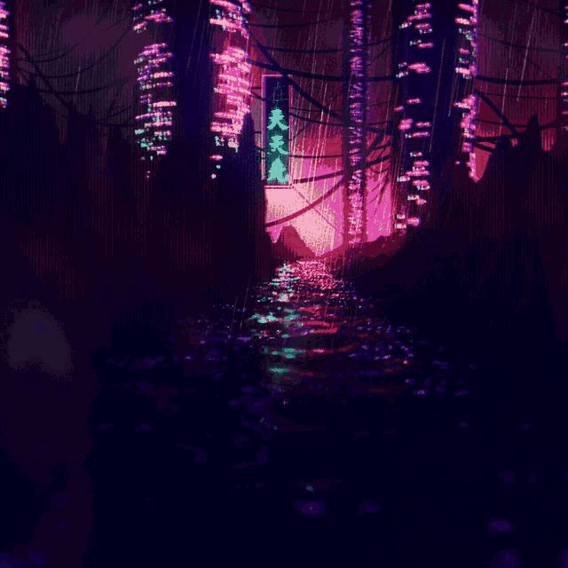
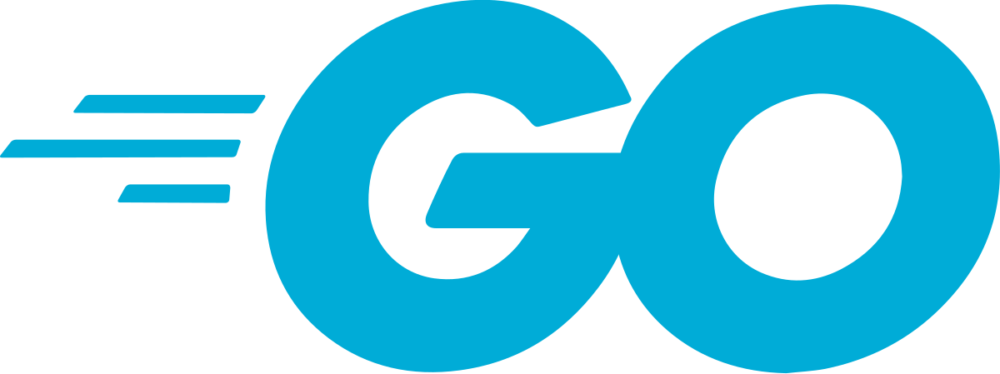
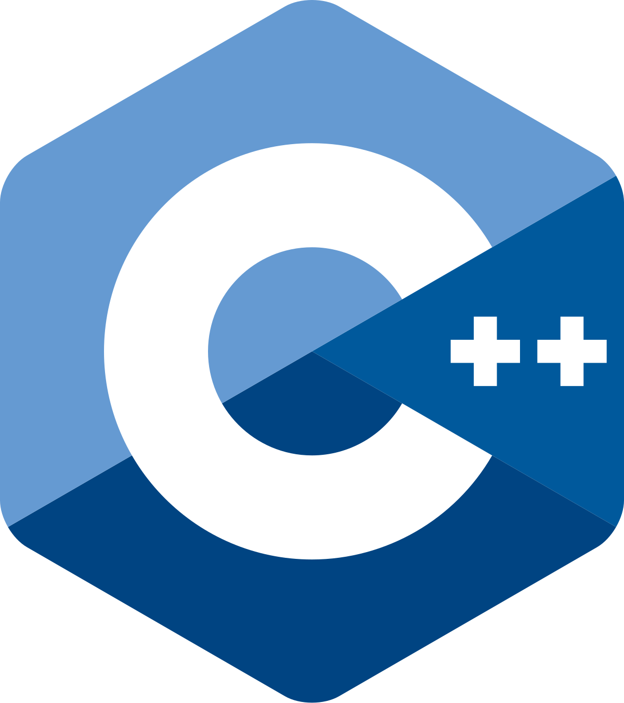
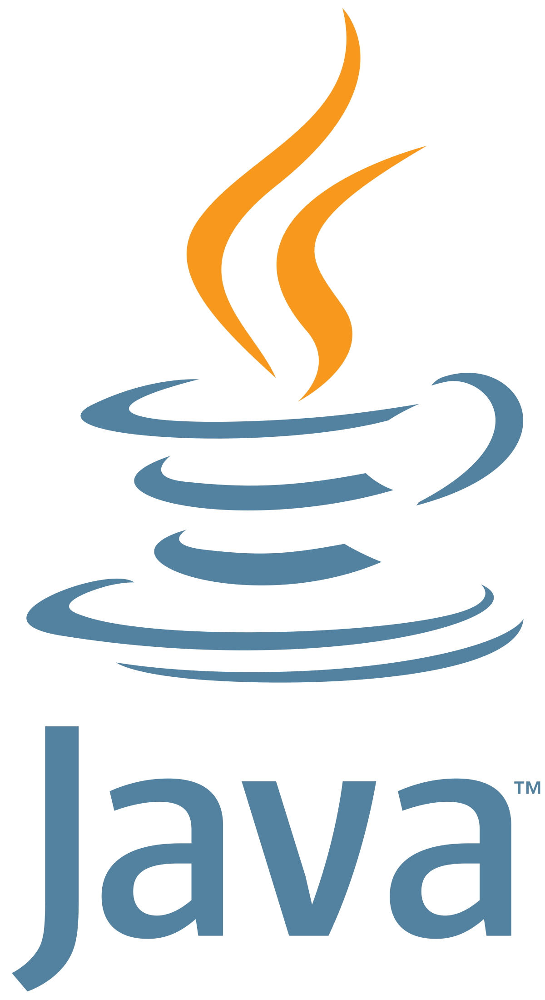
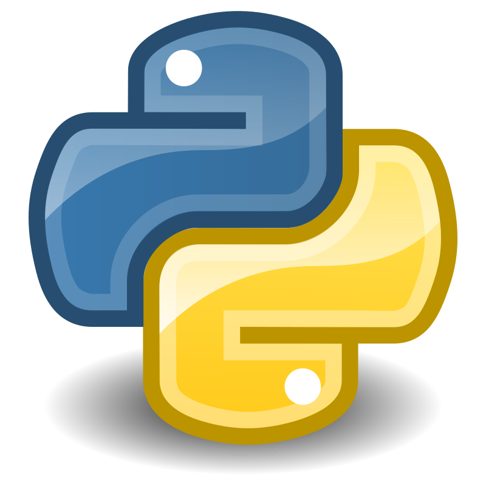

<picture>
  <source media="(prefers-color-scheme: light)" srcset="./japanese-morning-city.gif">
  <source media="(prefers-color-scheme: dark)" srcset="./chinese-night-city.gif">
  
</picture>

## Sobre meus projetos ✍

Aqui você irá encontrar projetos diversos, que abordam programação de baixo e alto nível de abstração.\
Já contribuí para repositórios que abordam as seguintes áreas:

🔒 Criptografia\
🤖 Robótica\
📞 Redes de computadores\
🖥 Desenvolvimento web\
📱 Desenvolvimento mobile

Como podem ver, sou muito curioso e estou sempre disposto a aprender novas áreas para expandir o meu conhecimento.

## Tecnologias 🔬

### Linguagens com as quais possuo experiência

  
   
  
  
  
  
  

